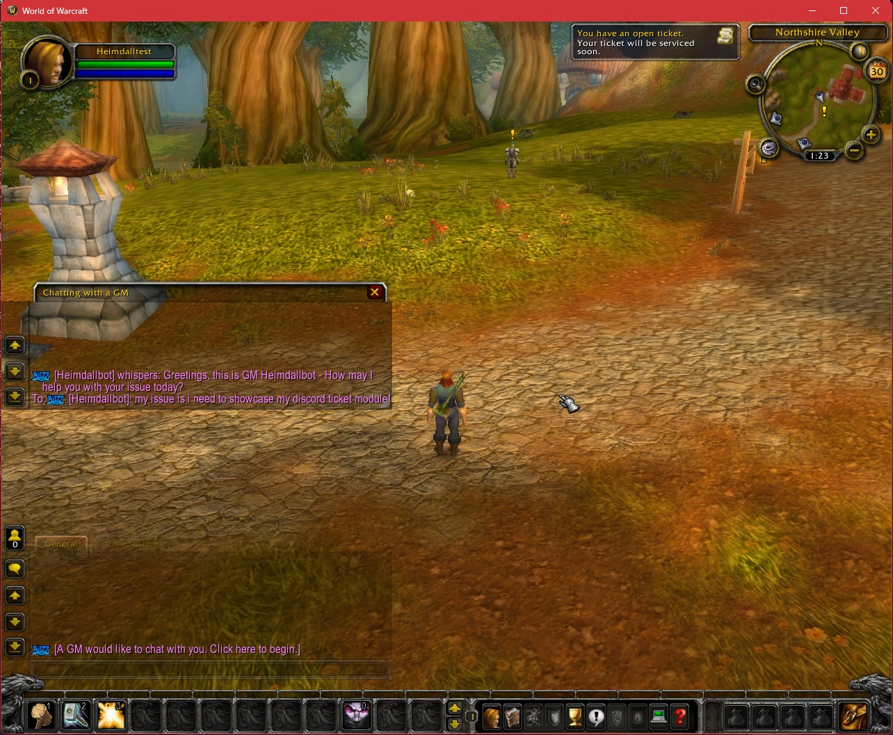
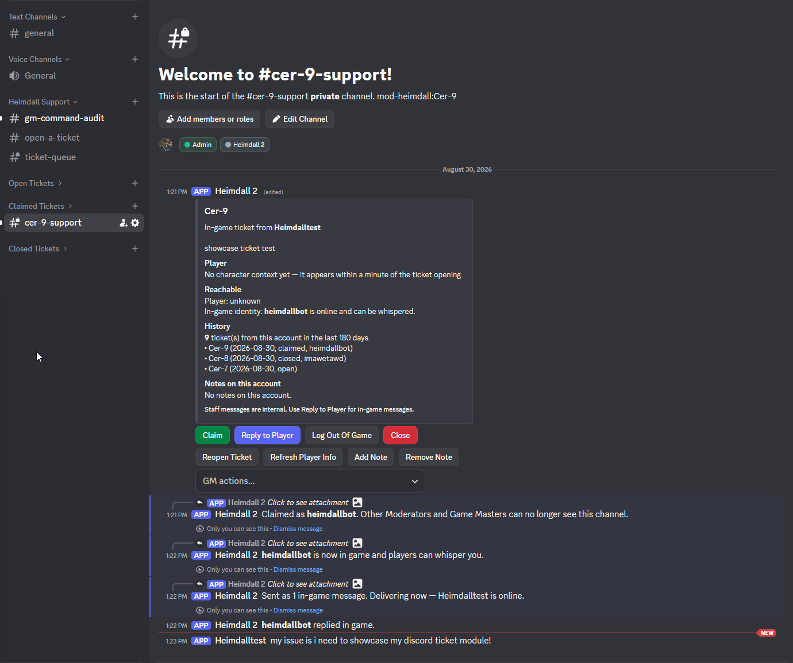

# mod-heimdall

[](https://discord.gg/DV9FuqzYby)


[](https://github.com/Calmoran/mod-heimdall/actions)

> [!IMPORTANT]
> **v1.0.0.** Tested end to end on Windows, Linux and Docker.

Heimdall is **A Discord ticket system for AzerothCore.** Heimdall bridges in-game GM tickets into private Discord channels your staff can work in, and gives your staff full two way communication with ingame players, from beginning to end of the ticket life. From the player point of view, nothing has changed. They still communicate with a GM Branded chat window, and send and receive whispers from ingame.

One repository, two halves: the server module (compiled into your worldserver) and the companion Discord bot in [`bot/`](bot/).


*What the player sees — an ordinary GM whisper. Nothing to install, nothing to learn.*


*What your staff sees — the ticket, who filed it, and the controls to work it.*

## Features

- GM Ticket discord bridge that allows fully functioning two-way natural looking communication between in-game player and GM in discord.
- A Ticket Queue channel showing all currently open tickets as well as who has claimed them to work on
- current ingame info about the ticket submitter (Player Name, level, race, class, zone, playtime of char and account age, and last seen, and an indicator of whether or not they are online)
- ticket tracking history by account
- small list of ingame commands the staff member can run
- trackable note system that follows by user account

## Requirements

- [AzerothCore](https://github.com/azerothcore/azerothcore-wotlk) (compiled from source)
- MySQL
- Node.js 20 or later (for the companion bot)
- A Discord bot application you control

## How to install

### 1) Clone the module

Clone this repository into your core's `modules/` directory:

```
cd azerothcore-wotlk/modules
git clone https://github.com/Calmoran/mod-heimdall.git
```

### 2) Apply the core patch

From the root of your core checkout:

```
git apply modules/mod-heimdall/patches/0001-expose-loginqueryholder-to-modules.patch
```
- NOTE: We borrow a change made by MOD PLAYERBOTS that allows an account to log in headless, which is what enables this module to work. The patch moves the `LoginQueryHolder` class declaration from `CharacterHandler.cpp` to `WorldSession.h` that lets your staff members GM character be logged in through the bot which enables the two way communication between player and GM

### 3) Re-run CMake and rebuild

```
cd azerothcore-wotlk
cmake -S . -B build -DMODULES=static
cmake --build build --config Release
```

Confirm the configure output lists `mod-heimdall` before building.

### 4) Database

Nothing to do — the SQL installs itself. On first startup the AzerothCore updater applies `data/sql/db-characters/base/heimdall.sql` to the Characters database, creating seven `heimdall_*` tables. It touches nothing else.

### 5) Configuration

Copy `conf/heimdall.conf.dist` to your worldserver's module config directory as `heimdall.conf` (next to `worldserver.conf`, e.g. `.../etc/modules/heimdall.conf`) and edit it.

Edit `heimdall.conf`, never the `.conf.dist` — the build overwrites `.dist` files on every compile.

Leave `Heimdall.Enabled = 0` until the bot is installed and configured, then set it to `1` and restart the worldserver.

### 6) Install the bot

Follow [`docs/INSTALL-bot.md`](docs/INSTALL-bot.md) from this same clone's `bot/` directory.

## Community

> [!TIP]
> **[Join the Discord server](https://discord.gg/DV9FuqzYby)** for discussions, updates, and support.

## Things to know before you install

The limits you can move live beside the settings that move them, in
[`conf/heimdall.conf.dist`](conf/heimdall.conf.dist) and [`bot/.env.example`](bot/.env.example).
These are the ones you cannot.

**A player may have one open in-game ticket at a time.** This is AzerothCore's own rule, enforced
in the core, not something Heimdall adds or can lift. Heimdall applies the same rule to
Discord-opened tickets, which is its own choice.

**Replies reach players as whispers, in 240-byte segments.** Longer replies are split on word
boundaries. A single word longer than that — a pasted URL, usually — is split mid-word rather than
refused.

**Staff space depends on who opened the ticket.** An in-game ticket's channel is staff-only by its
permissions, so staff work directly in it. A Discord-opened ticket's reporter is in the channel, so
staff discussion lives in a private thread instead. A private thread has no role-based visibility —
members are added one at a time — which is why Discord-opened tickets depend on the staff roster,
and why an empty roster is warned about.

**Discord's own ceilings** apply throughout: 2000 characters per message, 4096 per embed
description, 1024 per embed field, 25 options in a select menu, five component rows per message
(the ticket header uses three). Discord archives an inactive thread after a week; Heimdall reopens
one when it needs to.

**Character names are 12 characters**, and realm IDs above 255 are refused by the worldserver, so
an automatic realm tag is never longer than `R255`.

**What Heimdall does not do:** it never writes to `gm_ticket` — every in-game change goes through
documented GM commands, run by the module inside the worldserver. The bot has no way to send the
realm a command of its own choosing: it asks for one of a fixed list of actions, and the module
composes the command itself. The GM identity is a realm account, but it is the module's rather than
the bot's — its password is in no part of the bot's configuration, and a fully compromised bot could
neither log into it nor speak as it. It does not give the bot access to player data; the bot's
database account reaches only the seven `heimdall_*` tables. It does not link Discord accounts to
game accounts, so it cannot offer self-service actions on a character. It does not send item or gold
compensation. And it needs one small core patch to hold a GM identity in the world, which ships with
the module and changes no behaviour.

## Full documentation

- [`docs/INSTALL.md`](docs/INSTALL.md) — detailed module install, troubleshooting, platform notes
- [`docs/INSTALL-bot.md`](docs/INSTALL-bot.md) — bot install
- [`docs/CONFIGURATION.md`](docs/CONFIGURATION.md) — every setting, and how configuration changes are handled
- [`docs/OPERATIONS.md`](docs/OPERATIONS.md), [`docs/SECURITY.md`](docs/SECURITY.md) — running it

## How this was built

Most of Heimdall's code was written by Claude, with me
directing, reviewing and testing it extensively. Commits carry `Co-Authored-By` trailers.

I've adopted AzerothCore's [agentic engineering](https://www.azerothcore.org/wiki/agentic-engineering)
rules for this project. The one that matters most: nothing ships that hasn't been
built, run and verified in a real game session — "it compiles" is not testing.
Every feature here has been used against a live realm, and the install has been
done from scratch on a clean AzerothCore build.

See [CONTRIBUTING.md](CONTRIBUTING.md) for the full standard.

## Credits

Built for the [AzerothCore](https://www.azerothcore.org/) community.

## License

AGPL-3.0-or-later, covering both halves: the server module and the bot in `bot/`. The full text is
in [`LICENSE`](LICENSE).
